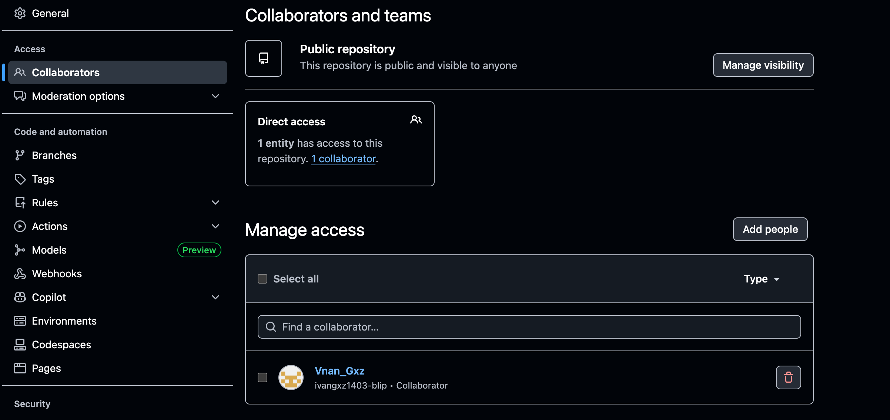
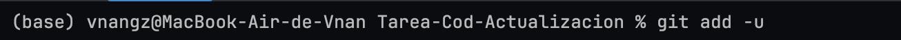
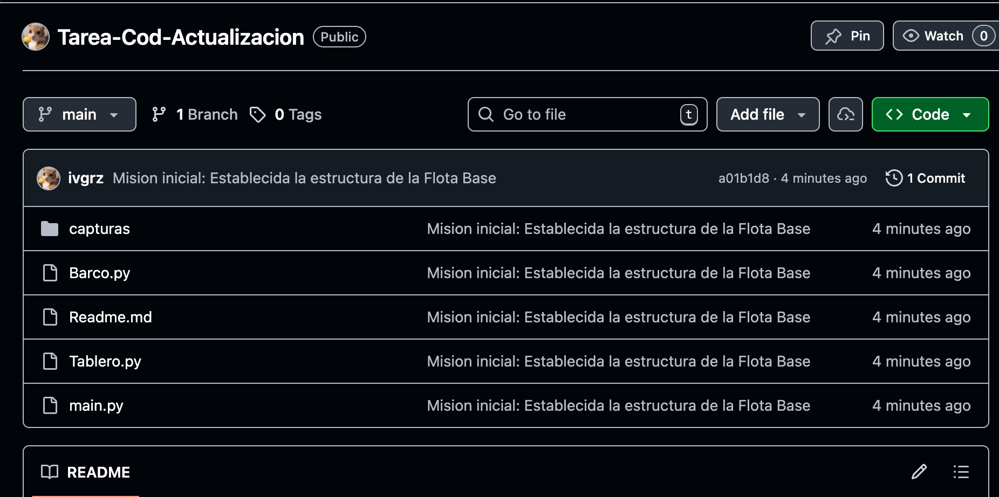
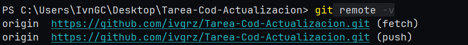
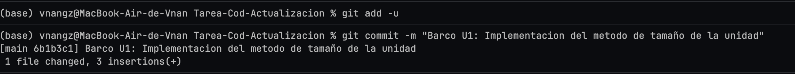
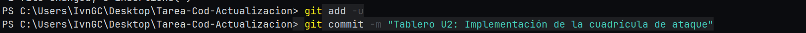
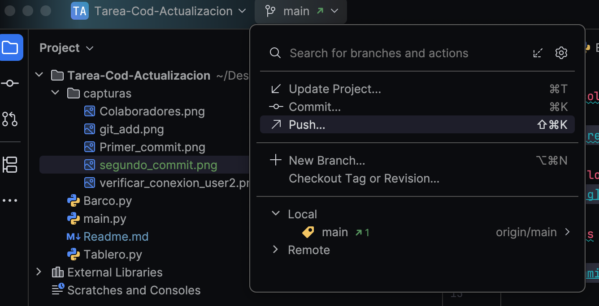
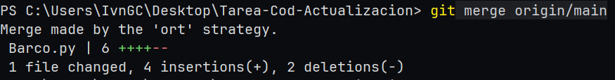

# Resolucion ejercicio:

## Hacemos colaborador al user2

## Añadimos los archivos con

## Realizamos el primer commit

## El user2 clona el repositorio y verifica la conexion remota

## El user1 hace cambios en la clase Barco y realiza el commit

## El user2 hace cambios en la clase tablero en su repositorio local y realiza un commit

## El user1 sube los cambios de la clase barco (push)

## El user2 hace un merge de los cambios del user1 (pull)

